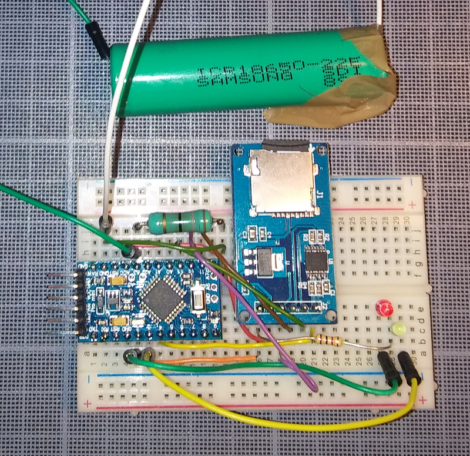

# Arduino based battery benchmark

This is a little project to test your batteries under 5 volt. The original idea come from [Skyduino](https://skyduino.wordpress.com/2012/07/03/arduino-faire-des-benchmark-de-piles-lr6-aaa/). 
I have improved the initial concept with LEDs and a SD card logger to make benchmarks computer-less or/and keep logs of your benchmarks. 



# Requierments

- A 5 volt Arduino (not 3.3v !)
- [SdFat Arduino library](https://github.com/greiman/SdFat)
- Two LEDs (optional) with a 1 Kohm resistor
- 15 ohm resistor, 1 W (whatever the precision, but you need to know the real value with a multimeter)
- SD card module [like this](https://fr.aliexpress.com/item/1x-Good-Micro-SD-Storage-Board-TF-Card-Reader-Memory-Shield-Module-SPI-for-arduino/32281952116.html?src=google&albslr=221466033&isdl=y&aff_short_key=UneMJZVf&source=%7Bifdyn:dyn%7D%7Bifpla:pla%7D%7Bifdbm:DBM&albch=DID%7D&src=google&albch=shopping&acnt=494-037-6276&isdl=y&albcp=653151748&albag=36672819047&slnk=&trgt=61865531738&plac=&crea=fr32281952116&netw=g&device=c&mtctp=&gclid=EAIaIQobChMIvOz--NbB2AIVBGYbCh1rCA2EEAUYBCABEgKntfD_BwE)
- Wires

# Wiring

**Digital**
- red LED to pin 2
- green LED to pin 3 
- SD card  CS to pin 4
- SD card MOSI to pin 11
- SD card  MISO to pin 12
- SD card  CLK to pin 13
 
**Analog**
- 15 ohm resistor between A3 and GROUND and your battery in parrallel (battery - to GOUND, battery + to A3 )

**Other**
- 1 Kohm between Arduino GROUND and common LEDs ground
- SD Card 5v to Arduino VCC
- SD Card GROUND to Arduino GRD


# Variables
You can easylly adapt the code through the variables. Especially the real value of your resistor : measure the real value of the 15 ohm resistor and adapt the variable *real_value_resistor*in your code.
You can change the time step between two measures, with *SAMPLE_INTERVAL_MS*. 
*min_threshold* sets the voltage threshold (volt) to turn the red LED under a specific voltage value.  

# Utilization 

**This design only accept battery UNDER 5 volt !!**

1. Power on the Arduino, the RED LED turns on, a new file was created and it's waiting for a battery.
2. Connect a battery, the GREEN LED turns on (and the red turns off), Arduino measures the voltage and log it the the file.
3. When the battery goes under 1 volt, the green LED turns off and the red LED turns on, but the log is still logging...

You can connect your Arduino to your computer and see the real-time plotting of the battery voltage. 
**/!\ Each time your launch a serial console (or serial plotter), the Arduino reboots, so a new file is created.** So is you want the real time plotting on the Arduino console, you need to connect to the computer, launch the serial console (or plotting) and after connect your battery. During the benchmark, if you close and re-launch the serial console, the Arduino will reboot !

## Serial results

```
Logging to : Benchm00.csv
1.14
1.10
1.09
1.08
```

*TO DO : Need a real-time plotting screenshot*

# Results interpretation

*TO DO...*
